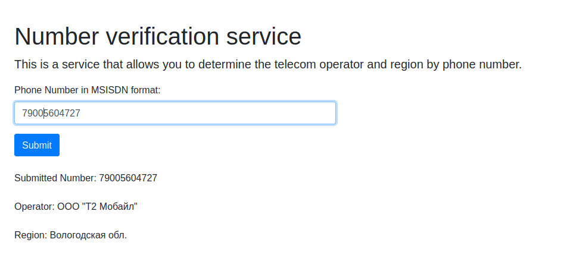
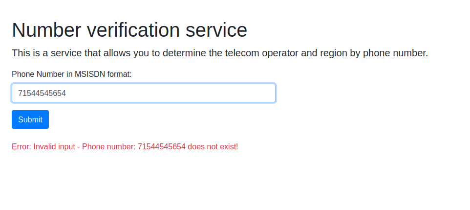

# WebApp: Number Operator and Region Identifier


## Description
This Django-based web application allows users to input a phone number through a simple form and receive information about the operator (carrier) and the geographical region associated with the number. The application is containerized using Docker for easy deployment and scalability.

## Prerequisites
Before you can run the web app, ensure you have the following installed:
- Docker
- Docker Compose

## Installation

Follow these steps to set up the web app on your local machine using Docker:

1. **Clone the Repository**
   If the code is hosted in a Git repository, clone it using the following command:
   ```
   git clone https://github.com/juliojm13/atrucks.git
   cd atrucks
   ```

   If you have the code as a ZIP file, simply extract it to a folder of your choice.

2. **Docker Setup**
   Within the root directory of the project, you should find a `Dockerfile` for building the Django app image and a `docker-compose.yml` if multiple containers are used.

3. **Build and Run with Docker**
   Execute the following command to build the Docker image and run the container:
   ```
   docker-compose up --build
   ```
   This command will build the image for the Django app and any other services defined in `docker-compose.yml`, and then start the containers.

## Usage

Once the Docker containers are up and running, follow these steps to use the web app:

1. **Access the Web App**
   Open your web browser and go to `http://localhost:80` or the port you defined in your Docker configuration.

2. **Enter the Phone Number**
   In the provided form on the web page, enter the phone number for which you want to find the operator and region information.

3. **Submit the Form**
   Click the 'Submit' button or press Enter to send the request.

4. **View Results**
   The web app will display the operator and region associated with the given phone number.






## Troubleshooting

If you encounter any issues while setting up or running the web app, consider the following:

- Ensure Docker is running on your machine.
- Check the Docker and Docker Compose logs for error messages.
- Verify that all Docker containers are up and running.
- Make sure your `Dockerfile` and `docker-compose.yml` files are correctly configured.

## Support

For additional help or to report issues, please open an issue.